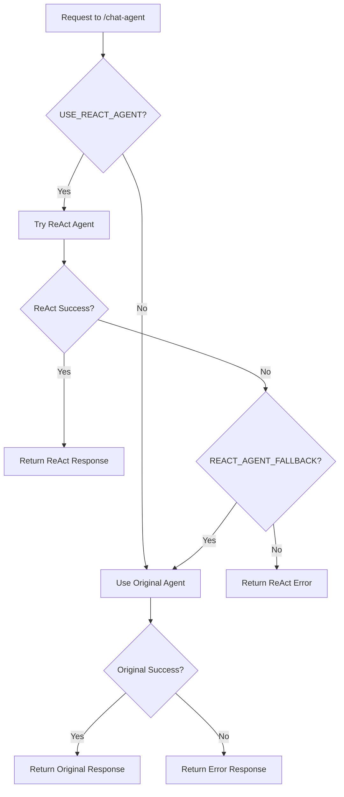

# Chat Agent ReAct Integration

## Overview

The `/chat-agent` endpoint has been successfully integrated with the new ReAct agent while maintaining full backward compatibility with the existing frontend. The integration provides intelligent reasoning capabilities with automatic fallback to the original agent system.

## Key Features

### ✅ **Seamless Integration**
- Frontend remains completely unchanged
- Same API endpoint (`/api/v1/agent/chat-agent`)
- Same request/response format with optional enhancements
- Zero breaking changes for existing clients

### ✅ **ReAct Agent as Primary Backend**
- Uses LangGraph-based ReAct agent for intelligent reasoning
- Step-by-step thought process with tool usage
- Enhanced problem-solving capabilities
- Access to all registered connectors as tools

### ✅ **Automatic Fallback System**
- Falls back to original conversational agent if ReAct fails
- Graceful error handling with user-friendly messages
- Configurable fallback behavior
- Ensures service reliability

### ✅ **Enhanced Response Format**
- Backward-compatible `AgentResponse` model
- Additional optional fields for ReAct capabilities:
  - `agent_type`: "react", "original", or "error"
  - `reasoning_trace`: Step-by-step reasoning process
  - `tool_calls`: Tools used during processing
  - `processing_time_ms`: Response time metrics

## Configuration Options

Add these environment variables to control behavior:

```env
# ReAct Agent Configuration
USE_REACT_AGENT=true                 # Enable ReAct agent (default: true)
REACT_AGENT_FALLBACK=true           # Enable fallback to original agent (default: true)
REACT_AGENT_MAX_ITERATIONS=10       # Maximum reasoning iterations (default: 10)

# Azure OpenAI (required for ReAct agent)
AZURE_OPENAI_ENDPOINT=your-endpoint
AZURE_OPENAI_API_KEY=your-key
AZURE_OPENAI_DEPLOYMENT_NAME=your-deployment
```

## API Usage

### Request Format (Unchanged)
```json
{
  "message": "Hello, can you help me understand what tools you have available?",
  "session_id": "user-session-123"
}
```

### Response Format (Enhanced)
```json
{
  "message": "I can help you with various tools including HTTP requests, Gmail, Google Sheets...",
  "session_id": "user-session-123",
  "conversation_state": "executing",
  "current_plan": null,
  
  // New optional fields (won't break existing frontend)
  "agent_type": "react",
  "reasoning_trace": [
    {
      "step_number": 1,
      "step_type": "thought",
      "content": "The user is asking about available tools...",
      "timestamp": "2025-01-27T..."
    }
  ],
  "tool_calls": [
    {
      "id": "call_1",
      "tool_name": "http_request",
      "parameters": {...},
      "status": "completed"
    }
  ],
  "processing_time_ms": 1500
}
```

## Agent Selection Logic



## Benefits

### **For Users**
- Enhanced AI capabilities with reasoning transparency
- Better problem-solving through tool usage
- Improved response quality and accuracy
- Seamless experience with no interface changes

### **For Developers**
- Zero frontend changes required
- Gradual migration path
- Comprehensive error handling
- Rich debugging information through reasoning traces

### **For Operations**
- Configurable behavior through environment variables
- Automatic fallback ensures high availability
- Performance metrics and monitoring
- Easy rollback capability

## Testing

### **Automated Testing**
```bash
python test_integrated_chat_agent.py
```

### **Manual Testing**
```bash
# Start the server
uvicorn app.main:app --reload

# Test the endpoint
curl -X POST "http://localhost:8000/api/v1/agent/chat-agent" \
  -H "Content-Type: application/json" \
  -d '{
    "message": "What tools do you have available?",
    "session_id": "test-123"
  }'
```

### **Frontend Testing**
- Existing frontend code works without changes
- Additional fields are optional and won't break UI
- Can enhance UI to show reasoning traces if desired

## Migration Strategy

### **Phase 1: Silent Integration** ✅
- ReAct agent integrated behind existing endpoint
- Frontend unchanged, users get enhanced capabilities
- Fallback ensures reliability

### **Phase 2: Frontend Enhancement** (Optional)
- Update frontend to display reasoning traces
- Show tool usage information
- Add agent type indicators

### **Phase 3: Full Migration** (Future)
- Remove original agent dependency
- Optimize for ReAct-only operation
- Enhanced UI for reasoning visualization

## Troubleshooting

### **Common Issues**

1. **ReAct agent not working**
   - Check Azure OpenAI configuration
   - Verify `langchain-openai` is installed
   - Check logs for initialization errors

2. **Fallback not working**
   - Ensure `REACT_AGENT_FALLBACK=true`
   - Check original agent dependencies
   - Verify database connectivity

3. **Performance issues**
   - Adjust `REACT_AGENT_MAX_ITERATIONS`
   - Monitor processing times
   - Consider caching strategies

### **Configuration Examples**

```env
# Production: ReAct with fallback
USE_REACT_AGENT=true
REACT_AGENT_FALLBACK=true
REACT_AGENT_MAX_ITERATIONS=8

# Development: Original agent only
USE_REACT_AGENT=false
REACT_AGENT_FALLBACK=false

# Testing: ReAct only (no fallback)
USE_REACT_AGENT=true
REACT_AGENT_FALLBACK=false
REACT_AGENT_MAX_ITERATIONS=5
```

## Monitoring

### **Key Metrics**
- Agent type usage distribution (react vs original vs error)
- Processing times by agent type
- Fallback frequency
- Error rates

### **Logging**
- Agent selection decisions
- Fallback triggers
- Performance metrics
- Error details

## Next Steps

1. **Deploy and Monitor**: Deploy the integration and monitor performance
2. **Gather Feedback**: Collect user feedback on response quality
3. **Optimize Configuration**: Tune settings based on usage patterns
4. **Frontend Enhancement**: Consider adding reasoning trace visualization
5. **Performance Optimization**: Optimize ReAct agent for production use

The integration is now complete and ready for production use! 🚀