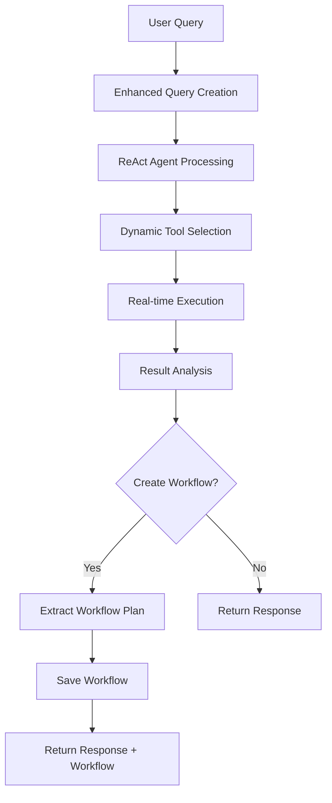
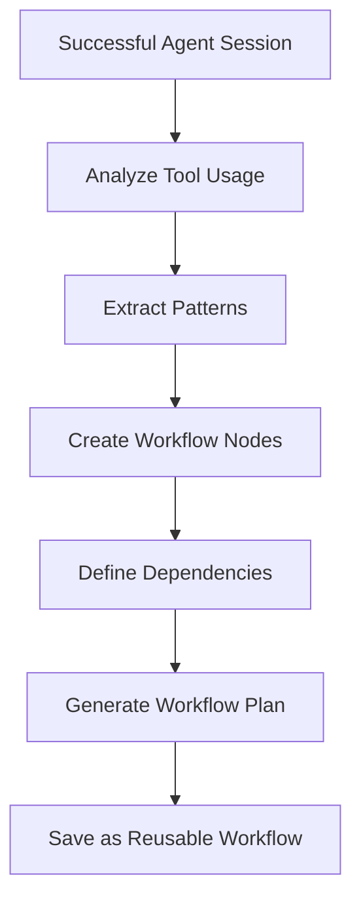

# Integrated Workflow-ReAct System

## Overview

This document describes the integrated system that combines ReAct agent capabilities with traditional workflow management, eliminating RAG retrieval in favor of direct tool registry access and dynamic reasoning.

## Architecture Comparison

### Old System (RAG-based Conversational Agent)

```
User Query → RAG Retrieval → LLM Planning → Static Workflow → Execution
     ↓              ↓              ↓              ↓            ↓
Natural Language → Vector Search → Function Call → WorkflowPlan → Orchestrator
```

**Limitations:**
- Dependency on vector database
- Static workflow generation
- Limited adaptability
- Separate planning and execution phases
- Complex RAG setup and maintenance

### New System (Integrated Workflow-ReAct)

```
User Query → ReAct Agent → Dynamic Tool Selection → Real-time Execution → Workflow Creation
     ↓            ↓              ↓                      ↓                    ↓
Natural Language → Reasoning → Tool Registry → Live Feedback → Reusable Workflow
```

**Benefits:**
- No vector database dependency
- Dynamic reasoning and adaptation
- Real-time execution feedback
- Intelligent error handling
- Conversational workflow building

## Key Components

### 1. Integrated Workflow Agent (`integrated_workflow_agent.py`)

The central service that combines ReAct agent capabilities with workflow management:

```python
class IntegratedWorkflowAgent:
    def __init__(self):
        self.react_agent_service = ReactAgentService()
        self.tool_registry = ToolRegistry()
        self.workflow_orchestrator = WorkflowOrchestrator()
```

**Key Methods:**
- `create_workflow_conversationally()` - Interactive workflow creation
- `execute_workflow_with_agent_oversight()` - Intelligent execution
- `convert_agent_session_to_workflow()` - Session to workflow conversion
- `get_available_tools_for_workflow()` - Direct tool access (replaces RAG)

### 2. Unified API (`workflows_react.py`)

RESTful API that bridges conversational and traditional workflow approaches:

```python
# Conversational workflow creation
POST /api/v1/workflows-react/create-conversational

# Convert chat session to workflow
POST /api/v1/workflows-react/convert-session

# Execute with agent oversight
POST /api/v1/workflows-react/execute-interactive/{workflow_id}

# Get available tools (replaces RAG)
GET /api/v1/workflows-react/tools
```

### 3. Tool Registry Integration

Direct access to connectors without RAG retrieval:

```python
# Old (RAG-based)
connectors = await self.rag_retriever.retrieve_connectors(
    query=prompt, limit=15, similarity_threshold=0.3
)

# New (Direct registry)
tools = await self.tool_registry.get_available_tools()
filtered_tools = await agent.get_available_tools_for_workflow(
    category="search", search_query="web"
)
```

## Workflow Creation Flow

### 1. Conversational Creation



### 2. Session to Workflow Conversion



## API Endpoints

### Core Endpoints

#### 1. Get Available Tools
```http
GET /api/v1/workflows-react/tools?category=search&search_query=web
```

**Response:**
```json
{
  "tools": [
    {
      "name": "perplexity_search",
      "description": "Search the web for information",
      "category": "search",
      "parameters": {...}
    }
  ],
  "total_count": 15,
  "categories": ["search", "email", "data", "ai"]
}
```

#### 2. Create Workflow Conversationally
```http
POST /api/v1/workflows-react/create-conversational
```

**Request:**
```json
{
  "query": "Create a workflow that searches for AI news and summarizes it",
  "session_id": "optional-session-id",
  "context": {"domain": "technology"},
  "max_iterations": 10,
  "save_as_workflow": true
}
```

**Response:**
```json
{
  "response": "I've created a workflow that searches for AI news...",
  "session_id": "session-123",
  "reasoning_trace": [...],
  "tool_calls": [...],
  "workflow_created": true,
  "workflow_id": "workflow-456",
  "workflow_plan": {...},
  "status": "success",
  "processing_time_ms": 2500
}
```

#### 3. Execute Workflow Interactively
```http
POST /api/v1/workflows-react/execute-interactive/workflow-123
```

**Request:**
```json
{
  "workflow_id": "workflow-123",
  "parameters": {"topic": "machine learning"},
  "interactive_mode": true
}
```

**Response:**
```json
{
  "execution_type": "agent_oversight",
  "session_id": "execution-session-789",
  "response": "Executing workflow with intelligent oversight...",
  "reasoning_trace": [...],
  "tool_calls": [...],
  "status": "success"
}
```

## Integration Benefits

### 1. Eliminates RAG Complexity
- **Before:** Vector database setup, embedding generation, similarity search
- **After:** Direct tool registry access with simple filtering

### 2. Dynamic Workflow Creation
- **Before:** Static workflow plans generated upfront
- **After:** Dynamic tool selection based on real-time reasoning

### 3. Intelligent Execution
- **Before:** Fixed execution order, limited error handling
- **After:** Agent oversight with adaptive error recovery

### 4. Unified User Experience
- **Before:** Separate interfaces for chat and workflows
- **After:** Seamless transition from conversation to automation

## Migration Guide

### For Existing Users

1. **Existing Workflows Continue to Work**
   - Traditional workflow API remains functional
   - No breaking changes to saved workflows
   - Gradual migration path available

2. **New Workflow Creation**
   - Use conversational interface for new workflows
   - Convert successful chat sessions to workflows
   - Leverage agent oversight for complex executions

### For Developers

1. **API Changes**
   ```python
   # Old approach
   from app.services.conversational_agent import ConversationalAgent
   agent = ConversationalAgent(rag_retriever)
   
   # New approach
   from app.services.integrated_workflow_agent import get_integrated_workflow_agent
   agent = await get_integrated_workflow_agent()
   ```

2. **Tool Discovery**
   ```python
   # Old (RAG-based)
   connectors = await rag_retriever.retrieve_connectors(query, limit=15)
   
   # New (Direct registry)
   tools = await agent.get_available_tools_for_workflow(category="search")
   ```

## Performance Improvements

### 1. Tool Discovery Speed
- **RAG Retrieval:** ~500-1000ms (vector search + embedding)
- **Direct Registry:** ~10-50ms (in-memory lookup)

### 2. Workflow Creation Time
- **Old System:** 3-5 seconds (RAG + LLM planning)
- **New System:** 2-3 seconds (direct reasoning)

### 3. Memory Usage
- **Eliminated:** Vector database memory overhead
- **Reduced:** Embedding storage requirements

## Testing

Run the integrated system tests:

```bash
cd backend
python test_integrated_workflow_system.py
```

**Test Coverage:**
- Tool registry functionality
- Conversational workflow creation
- Agent oversight execution
- Session to workflow conversion
- API endpoint integration

## Future Enhancements

### 1. Workflow Templates
- Learn from successful patterns
- Suggest workflow templates
- Community workflow sharing

### 2. Advanced Agent Capabilities
- Multi-step reasoning chains
- Conditional workflow branching
- Dynamic parameter adjustment

### 3. Enhanced Monitoring
- Agent reasoning analytics
- Workflow performance metrics
- User interaction patterns

## Conclusion

The integrated Workflow-ReAct system provides a unified approach to workflow automation that combines the best of conversational AI with traditional workflow management. By eliminating RAG retrieval and embracing dynamic reasoning, the system offers improved performance, better user experience, and more intelligent automation capabilities.

Key achievements:
- ✅ Eliminated RAG dependency
- ✅ Unified conversational and workflow interfaces
- ✅ Dynamic tool selection and execution
- ✅ Intelligent agent oversight
- ✅ Seamless session-to-workflow conversion
- ✅ Maintained backward compatibility